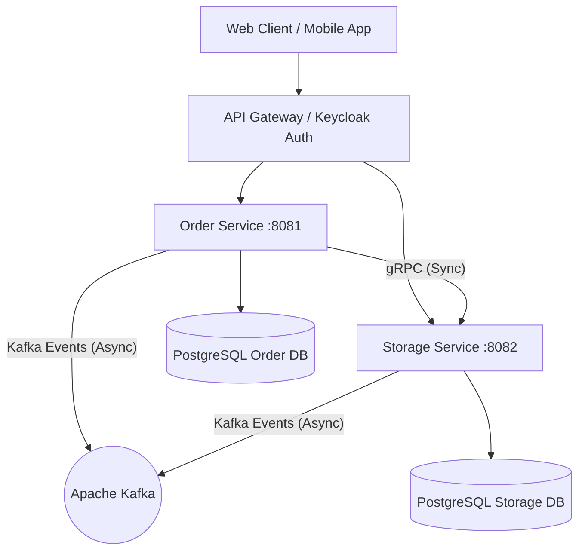

# 🚗 Car Dealership Microservices Platform


---

## 📌 О проекте

Высоконагруженная микросервисная платформа для автоматизации процессов автосалона (управление заказами, запчастями, автомобилями, проведения тест-драйвов и складского учета).

Проект спроектирован по принципам **Onion Architecture (Луковая архитектура)**, гарантирующим слабую связанность компонент, высокую тестируемость и изоляцию бизнес-логики от внешних фреймворков.

---

## 🏗 Архитектура и Структура Сервисов

Платформа состоит из нескольких изолированных микросервисов:



### 📦 Сервисы:

* **`order-service`** (`:8081`, gRPC `:8085`)
  * Управление клиентами, менеджерами, администраторами и пользователями системы.
  * Создание, бронирование и отслеживание статусов заказов на авто.
  * Управление заявками на тест-драйв.
  * Финансовые операции и история платежей.
  
* **`storage-service`** (`:8082`, gRPC `:9090`)
  * Каталог автомобилей, комплектаций и опций (Цвет, Двигатель, Трансмиссия, Привод).
  * Складской учет запчастей и комплектующих.
  * Операции поступления, списания и перемещения по складам.

* **`common`**
  * Общие Protobuf-схемы gRPC контрактов.
  * Общие модель передачи данных и базовые утилиты.

---

## 🧅 Луковая Архитектура (Onion Architecture)

Каждый микросервис имеет строгое разделение по слоям:

```
src/main/java/
 ├── domain/           # 🟢 Ядро: Модели, доменные валидации, доменные события, интерфейсы репозиториев
 ├── application/      # 🟡 Бизнес-логика: Use Cases, сервисы, мапперы, DTOs
 ├── infrastructure/   # 🔵 Инфраструктура: JPA entities, gRPC адаптеры, Kafka продюсеры/консьюмеры, Security
 └── presentation/     # 🔴 Представление: REST контроллеры, Swagger OpenAPI, обработчики ошибок
```

1. **Domain Layer (Ядро)**: Не имеет никаких внешних зависимостей (чистый Java 21). Содержит бизнес-правила и сущности.
2. **Application Layer**: Оркестрирует выполнение доменных сценариев и предоставляет DTO.
3. **Infrastructure Layer**: Содержит реализацию доменных портов (Spring Data JPA, Keycloak JWT Converter, gRPC clients, Kafka brokers).
4. **Presentation Layer**: Точки входа (REST Controllers), глобальные обработчики ошибок (`GlobalExceptionHandler`).

---

## 🛠 Технологический Стек

### Core Frameworks & Languages
* **Java 21**: Использование современных фич Java (Records, Pattern Matching, Virtual Threads ready).
* **Spring Boot 2.7.18**: Базовый фреймворк приложения (Spring MVC, Spring Data JPA, Spring Security).
* **Lombok & MapStruct**: Автоматическая генерация boilerplate-кода и высокопроизводительный маппинг объектов с `lombok-mapstruct-binding`.

### Безопасность и Аутентификация
* **Keycloak IAM**: Единый центр аутентификации и авторизации (OAuth2 & OpenID Connect).
* **Spring Security OAuth2 Resource Server**: Декодирование и валидация JWT токенов с ролевой моделью (Client, Manager, Warehouse Admin, System Admin).

### Межсервисное Взаимодействие
* **gRPC (Netty)**: Высокоскоростное синхронное взаимодействие между сервисами по протоколу HTTP/2 (Protobuf).
* **Apache Kafka**: Асинхронное событийное взаимодействие (Event-Driven Architecture) с поддержкой **Transactional Outbox Pattern** для гарантированной доставки сообщений.

### Базы Данных и Миграции
* **PostgreSQL 15+**: Реляционная СУБД с независимыми базами данных на каждый сервис.
* **Liquibase**: Автоматическое и воспроизводимое управление версионированием схем БД через XML-чейнджлоги.

### Тестирование
* **JUnit 5 & AssertJ**: Покрытие доменного и прикладного слоев.
* **Mockito 4/5 (Inline MockMaker)**: Поддержка статических моков (`mockStatic`).
* **Testcontainers**: Интеграционное тестирование на реальных контейнерах Docker (PostgreSQL, Kafka).

---

## 🚀 Запуск и Сборка

### Предварительные требования
* **JDK 21**
* **Docker Desktop** (для запуска интеграционных тестов с Testcontainers)

### Команды Gradle Wrapper

#### Сборка проекта (без выполнения тестов):
```bash
./gradlew build -x test -x integrationTest
```

#### Запуск всех юнит-тестов:
```bash
./gradlew test
```

#### Запуск интеграционных тестов:
```bash
./gradlew integrationTest
```

#### Полная очистка и пересборка:
```bash
./gradlew clean build
```

---

## 📄 Лицензия

Проект распространяется для учебных и демонстрационных целей.
