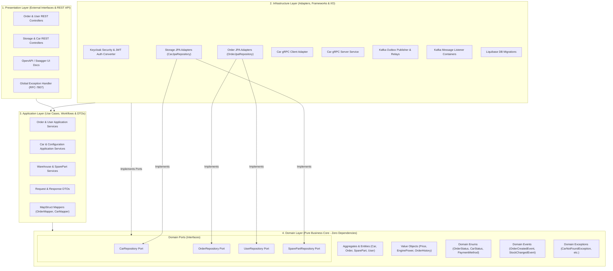
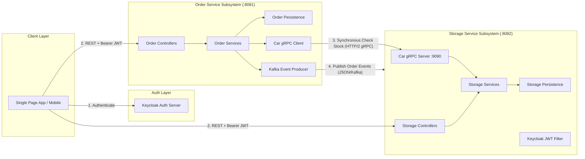

# 🚗 Car Dealership Enterprise Microservices Platform


---

## 📋 Оглавление

1. [О проекте](#-о-проекте)
2. [Архитектурный шаблон: Onion Architecture](#-архитектурный-шаблон-onion-architecture)
   - [Глубокий разбор слоев](#глубокий-разбор-слоев)
   - [Таблица ответственности слоев](#таблица-ответственности-слоев)
3. [Детальная Спецификация Микросервисов](#-детальная-спецификация-микросервисов)
   - [Order Service (Служба Заказов и Пользователей)](#1-order-service-порт-8081-grpc-8085)
   - [Storage Service (Служба Склада и Автомобилей)](#2-storage-service-порт-8082-grpc-9090)
   - [Common Модуль](#3-common-модуль)
4. [Безопасность и Ролевая Модель (Keycloak IAM)](#-безопасность-и-ролевая-модель-keycloak-iam)
5. [Межсервисное Взаимодействие (gRPC & Event-Driven Kafka)](#-межсервисное-взаимодействие-grpc--event-driven-kafka)
   - [Синхронный gRPC](#1-синхронный-grpc-high-speed-ipc)
   - [Асинхронные события и Outbox Pattern](#2-асинхронные-события-kafka--outbox-pattern)
6. [База Данных и Версионирование (PostgreSQL & Liquibase)](#-база-данных-и-версионирование-postgresql--liquibase)
7. [Тестирование и Надежность](#-тестирование-и-надежность)
8. [CI/CD Пайплайн](#-cicd-пайплайн)
9. [Инструкция по Запуску](#-инструкция-по-запуску)

---

## 📌 О проекте

**Car Dealership Microservices Platform** — распределенная высоконагруженная корпоративная платформа для автоматизации всех бизнес-процессов современного автосалона:
- Продажа готовых автомобилей со склада и заказ уникальных комплектаций под фабричное производство.
- Управление бронированием и проведением тест-драйвов.
- Финансовый учет, обработка платежей и возвратов.
- Складской учет запасных частей, деталей и совместимостей с моделями.
- Полноценная ролевая иерархия (Клиенты, Менеджеры, Админы Склада, Системные Администраторы).

Система спроектирована с акцентом на **Zero-Defect Architecture**, высокую масштабируемость, независимое развертывание сервисов и строгую изоляцию бизнес-логики от деталей инфраструктуры.

---

## 🧅 Архитектурный шаблон: Onion Architecture

Вся система построена по принципам **Onion Architecture (Луковая архитектура / Clean Architecture)**. Главная идея — **Закон инверсии зависимостей (Dependency Inversion Principle)**: внутренние слои ничего не знают о внешних. Зависимости направлены исключительно снаружи внутрь.



### Глубокий разбор слоев:

#### 1. 🟢 Domain Layer (Чистое доменное ядро)
* **Назначение**: Абсолютно чистая бизнес-логика. Содержит только стандартный Java 21 без каких-либо фреймворковых зависимостей (нет Annotations Spring, JPA, Jackson и т.д.).
* **Содержимое**:
  * **Domain Models / Aggregate Roots**: `Car`, `Order`, `TestDriveRequest`, `SparePart`, `User` (`Client`, `Manager`, `SystemAdmin`, `WarehouseAdmin`).
  * **Value Objects**: `Price`, `EngineDisplacement`, `EnginePower`, `OrderHistoryEntry`.
  * **Enums**: `OrderStatus`, `OrderType`, `PaymentMethod`, `PaymentStatus`, `CarStatus`, `UserStatus`, `AdminLevel`, `WarehousePosition`.
  * **Domain Ports (Интерфейсы)**: `CarRepository`, `OrderRepository`, `UserRepository`, `SparePartRepository`.

#### 2. 🟡 Application Layer (Прикладной слой / Сценарии использования)
* **Назначение**: Реализация бизнес-кейсов приложения (Use Cases), координация работы доменных моделей и преобразование данных.
* **Содержимое**:
  * **Application Services**: `OrderClientServiceImpl`, `CarManagerServiceImpl`, `SparePartWarehouseAdminServiceImpl`.
  * **DTOs (Data Transfer Objects)**: Запросы и ответы приложения.
  * **Mappers (Интерфейсы маппинга)**: `OrderMapper`, `CarMapper`, `SparePartMapper`.

#### 3. 🔵 Infrastructure Layer (Инфраструктурный слой)
* **Назначение**: Связь приложения с внешним миром (БД, брокеры сообщений, сетевые протоколы, сервисы авторизации).
* **Содержимое**:
  * **Persistence**: JPA Сущности (`CarEntity`, `OrderEntity`), Spring Data JPA репозитории (`CarJpaRepository`), Адаптеры репозиториев (`CarRepositoryAdapter`), реализующие доменные порты.
  * **Communication**: gRPC клиенты/серверы (`CarGrpcClient`, `CarGrpcService`), Kafka Producers & Listener Containers.
  * **Security**: `KeycloakJwtAuthenticationConverter`, `SecurityConfig`, экстракторы прав из JWT токенов.

#### 4. 🔴 Presentation Layer (Слой представления)
* **Назначение**: REST API точки входа для внешних клиентов (Frontend, Mobile, Third-Party).
* **Содержимое**:
  * **REST Controllers**: `OrderClientController`, `CarManagerController`, `SystemAdminController`.
  * **OpenAPI / Swagger Annotations**: Документирование API.
  * **Global Exception Handlers**: `GlobalExceptionHandler` для перехвата бизнес-исключений и конвертации их в RFC-7807 Problem Details HTTP ответы.

---

### Таблица ответственности слоев

| Слой | Что содержит | Зависит от | Каким технологиям разрешено находиться |
| :--- | :--- | :--- | :--- |
| **Domain** | Модели, Валидации, Внутренние правила, Порты | *Ни от кого* | Pure Java 21 |
| **Application** | Use Cases, DTOs, Маппинг | **Domain** | Java 21, Lombok, MapStruct |
| **Infrastructure** | Реализация адаптеров, БД, gRPC, Kafka, Security | **Domain, Application** | Spring Boot, JPA/Hibernate, Keycloak, gRPC, Kafka, Liquibase |
| **Presentation** | REST Controllers, Handlers | **Application** | Spring Web, SpringDoc OpenAPI |

---

## ⚙️ Детальная Спецификация Микросервисов



### 1. Order Service (Порт `:8081`, gRPC `:8085`)
Отвечает за работу с пользователями, оформительский цикл заказов, тест-драйвы и финансовые транзакции.

* **Основные доменные блоки**:
  * **Orders**: Заказы в наличии (`IN_STOCK`) и индивидуальные фабричные сборки (`CUSTOM`). Жизненный цикл статусов: `CREATED` ➔ `MANAGER_APPROVED` / `STOCK_CONFIRMED` ➔ `AWAITING_PAYMENT` ➔ `PAID` ➔ `AWAITING_DELIVERY` ➔ `READY_FOR_PICKUP` ➔ `DELIVERED` (или `CANCELLED`).
  * **Test Drive**: Заявки на тест-драйв с бронированием слота времени, назначением менеджера и отметкой прохождения/неявки.
  * **Payments**: Инициация платежа, обработка статусов успеха/ошибки, учет транзакций и процедуры возврата средств (`REFUNDED`).
  * **Users & Roles**: Хранение профилей клиентов, менеджеров, админов склада и системных админов.

### 2. Storage Service (Порт `:8082`, gRPC `:9090`)
Каталог техники, гибкий конструктор конфигураций и складской учет.

* **Основные доменные блоки**:
  * **Car Catalog & Configurations**: Машины, Цвета, Кузовы, Приводы, Комплекты Двигателей и Трансмиссий. Вычисление стоимости с учетом выбранных премиальных опций.
  * **Warehouse & Spare Parts**: Учет автозапчастей, каталожные номера, совместимость с кузовами/моделями, пороги минимальных остатков (`lowStock`, `outOfStock`).
  * **Stock Operations**: Запись истории складских операций (поступление, списание, инвентаризация, перемещение).

### 3. Common Модуль
Общая библиотека, содержащая `.proto` файлы для генерации gRPC-классов Protobuf, общие структуры ответов и системные константы.

---

## 🔐 Безопасность и Ролевая Модель (Keycloak IAM)

Безопасность системы построена на стандарте **OAuth 2.0 / OpenID Connect** с использованием серверного решения **Keycloak**.

### Схема работы авторизации:
1. Пользователь аутентифицируется в Keycloak и получает подправленный **RSA-256 JWT Access Token**.
2. В токен внедрены роли пользователя (`realm_access.roles` или `resource_access`).
3. При каждом REST запросе `KeycloakJwtAuthenticationConverter` декодирует JWT токен, извлекает `sub` (User ID), `email`, `preferred_username` и конвертирует роли в Spring `GrantedAuthority` с префиксом `ROLE_`.

```
JWT Token ➔ Bearer Filter ➔ JwtDecoder ➔ KeycloakJwtAuthenticationConverter ➔ SecurityContext
```

### Ролевая матрица доступов (RBAC):

| Роль | Полномочия в системе |
| :--- | :--- |
| **`ROLE_CLIENT`** | Просмотр каталога авто и запчастей, оформление своих заказов, запись на тест-драйв, оплата собственных счетов. |
| **`ROLE_MANAGER`** | Подтверждение заказов клиентов, управление автопарком для тест-драйва, просмотр назначенных заявок. |
| **`ROLE_WAREHOUSE_ADMIN`** | Приемка деталей на склад, списание брак/утеря, перемещение между секциями, изменение порогов остатков. |
| **`ROLE_SYSTEM_ADMIN`** | Полный доступ: управление пользователями, блокировка аккаунтов, назначение прав, аудит системных логов. |

---

## 🛰 Межсервисное Взаимодействие (gRPC & Event-Driven Kafka)

Система комбинирует два подхода к взаимодействию микросервисов:

### 1. Синхронный gRPC (High-Speed IPC)
Используется, когда сервису `order-service` необходимо **мгновенно** проверить наличие машины или детальной конфигурации в `storage-service` до сохранения заказа.
* Протокол: **HTTP/2**.
* Формат данных: **Protocol Buffers v3** (бинарная сериализация, минимальный оверхед по сети).
* Клиентский стартер: `net.devh:grpc-client-spring-boot-starter:2.15.0.RELEASE`.

### 2. Асинхронные события (Kafka & Transactional Outbox Pattern)
Используется для уведомлений и межсервисной синхронизации состояний без жесткого зацепления (Loose Coupling).
* Топики Kafka: `order-events`, `storage-events`.
* Для предотвращения потери сообщений при сбоях сети используется **Transactional Outbox Pattern**: событие сохраняется в локальную таблицу БД в той же транзакции, что и доменные изменения, после чего background-релей публикует его в топик Kafka.

---

## 🗄 База Данных и Версионирование (PostgreSQL & Liquibase)

Каждый микросервис владеет своей собственной физически изолированной СУБД (шард-принцип **Database-per-Service**).

* **Order DB**: PostgreSQL (База заказов, клиентов, транзакций).
* **Storage DB**: PostgreSQL (База автомобилей, конфигураторов, складских остатков).

Управление изменениями схемы БД происходит через **Liquibase**. Все миграции написаны в строгой версионной структуре:

```
src/main/resources/db/changelog/
 ├── db.changelog-master.xml
 ├── v1/
 │    └── v1-initial-schema.xml
 └── v2/
      └── v2-insert-reference-data.xml
```

---

## 🧪 Тестирование и Надежность

Проект покрыт несколькими уровнями тестирования:

1. **Unit Tests (JUnit 5 & Mockito 4/5)**:
   - Полное покрытие логики агрегатов домена и мапперов.
   - Использование **Mockito Inline / Static Mocks** (`mockStatic(SecurityUtils.class)`) для изолированного тестирования контекста безопасности.
2. **Integration Tests (Testcontainers)**:
   - Полный запуск контекста Spring Boot (`@SpringBootTest`).
   - Автоматический подъем реальных Docker-контейнеров с **PostgreSQL 15** и **Apache Kafka** на время выполнения интеграционных тестов.
   - Тестирование реальных SQL-запросов и миграций Liquibase.

---

## 🚀 CI/CD Пайплайн

В проекте настроен автоматический CI пайплайн на базе **GitHub Actions** (`.github/workflows/ci.yml`).

Пайплайн запускается при каждом коммите и Pull Request:
1. Выкачивает репозиторий (`actions/checkout@v4`).
2. Настраивает JDK 21 (Eclipse Temurin) с кэшированием зависимостей Gradle.
3. Выполняет этап компиляции и проверки сборки: `./gradlew clean assemble`.
4. Запускает изолированные юнит-тесты: `./gradlew test`.
5. Запускает интеграционные тесты с поднимающимися контейнерами Testcontainers: `./gradlew integrationTest`.

---

## 💻 Инструкция по Запуску

### Требования:
- **JDK 21**
- **Docker Desktop** (запущенный)

### Команды Gradle

Сборка проекта без запуска тестов:
```bash
./gradlew build -x test -x integrationTest
```

Запуск всех юнит-тестов:
```bash
./gradlew test
```

Запуск всех интеграционных тестов:
```bash
./gradlew integrationTest
```

Полная очистка и пересборка с прогоном всего тестового сюита:
```bash
./gradlew clean build
```
